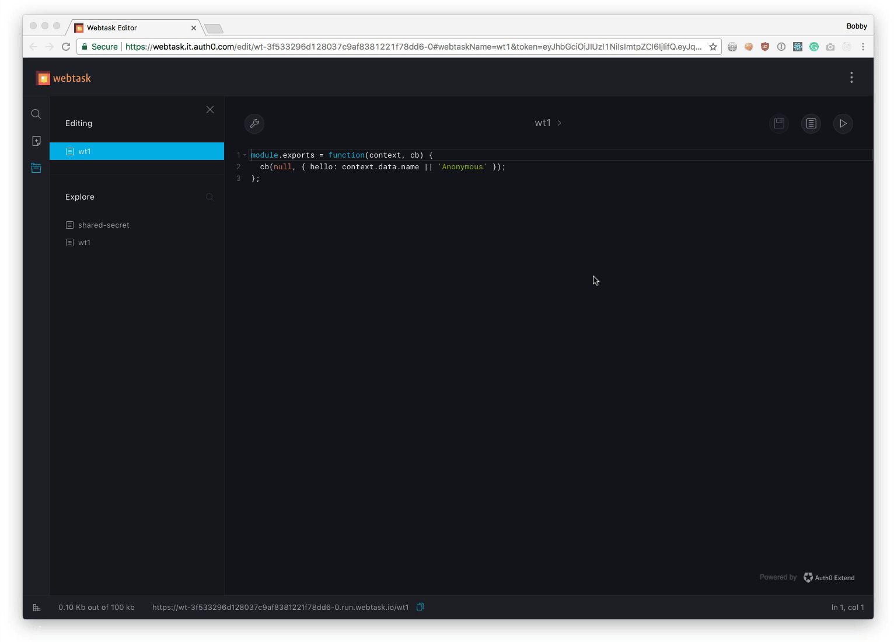
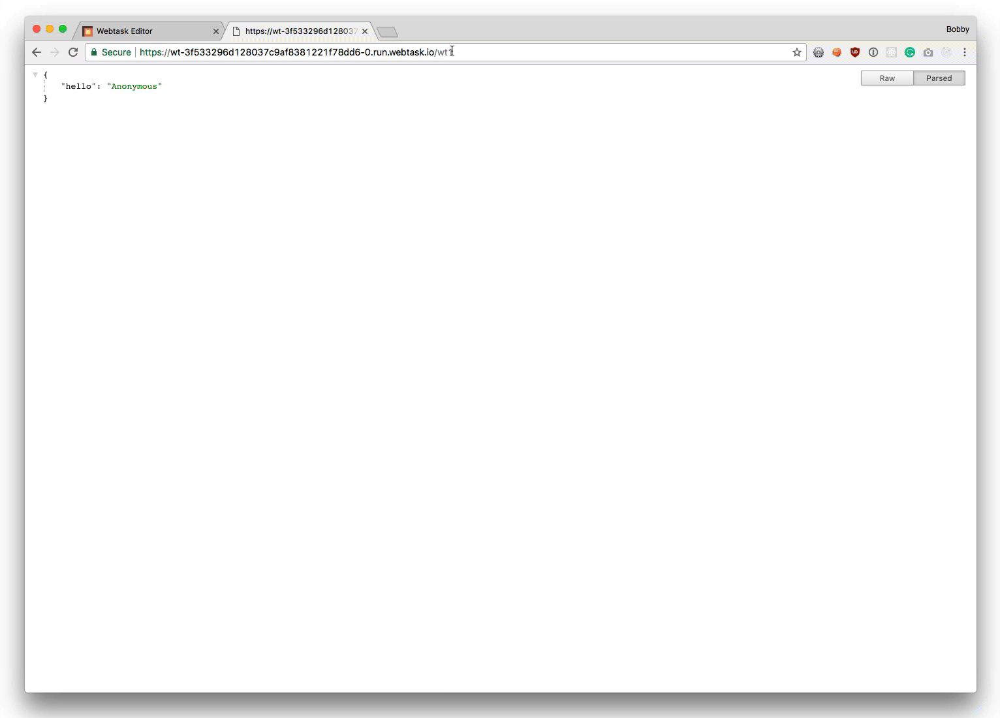
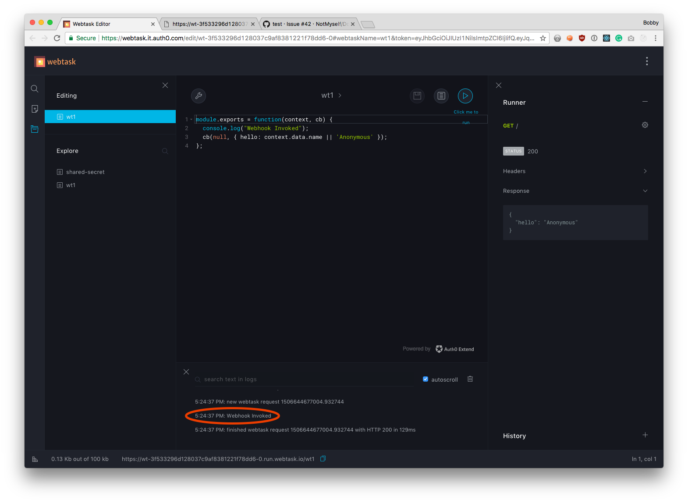
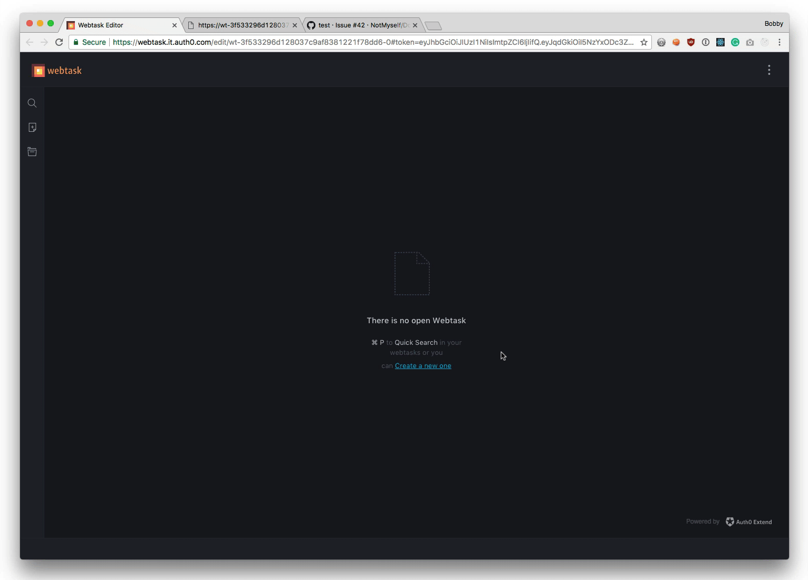

# Hello Editor

Let's jump in and create your first webtask. 

## Authenticate

- Open your browser to [https://webtask.io/make](https://webtask.io/make)
- This will give you a prompt to log in. 
- Choose any of the credentials listed.


After you have logged in, you'll be taken to the **Auth0 Webtask Editor**.

## Create a Webtask

- Click the `Create a new one` link. 
- Select the `Create empty` option in the **Create New** dialog.
- Enter `wt1` for the webtask name.
- Click `Save`. 

Once you do you'll be taken right to the editor with a starter webtask.


This webtask outputs a JSON object with a `hello` property and a value of either Anonymous or the `name` query string value.

Notice the two params of the function. `context` is the webtask Context object. We'll come back to this later. The second param is `cb` which is the callback. The callback accepts two params `error` and `body` and **must** be called when the task completes execution, in order to return some data and a response code.

## Run the Webtask

- Click on the `play` button which will bring up the runner. 
- Click `Run`. 
 


You'll see you webtask is instantly executed and the message `{"hello":"Anonymous"}` is returned in the Runner window.

 - Click on the Gear icon in the upper right of the runner.
 - Click on URL Params(0) and you will get an area to enter query string key/value pairs. 
 - Put the parameter `name` and then your name for the value.
 - Click `Run`.


You'll see that the name is outputted `{"hello":"Your Name"}`.

## View Logs

- Click on the `logs` button which will bring up the log viewer.
- Click on the Gear icon in the upper right hand corner of the runner.
- Click `Run`.


Notice the realtime log viewer shows each time the task is executed and how the long the execution takes.

## Write Logs

- Check the tick box in the logs viewer labed `autoscroll`.
- Modify the code to write the `data` to the console using `console.log`.
- Click on the `save` button which will save your code changes.
- Click on the Gear icon in the upper right hand corner of the runner.
- Click `Run`.

Your code should look like this:

```javascript
module.exports = function(context, cb) {
  console.log(context.data); 
  cb(null, { hello: context.data.name || 'Anonymous' });
};
```


## Calling a Webtask from the Browser

Each Auth0 Webtasks you create is automatically an HTTP endpoint. There's no special configuration, as soon as you create it, it is available over HTTP.

Let's try this out. 

If you look in the editor footer, you'll see a url with a copy/paste button. 

- Click it and it will copy your URL to the clipboard.
- Hit `Ctrl-T` or `CMD-T` to open a separate browser tab.
- Paste the Url in your address bar and hit `enter`.


You'll see your webtask return the anonymous result.

```javascript
{
    hello: "Anonymous"
}
```

- Modify the URL and add the name param i.e. `?name=Your Name` (using your name). 
- Hit `enter`. 


 
You'll see as before that your name is returned.

```javascript
{
    hello: "Your Name"
}
```

## Using a Webtask as a Webhook

That URL can now easily be plugged in as a Webhook. You can try that out using one of our favorite Webhook based services, [Github](https://github.com).

- Modify the code of your webtask and change the `console.log` statement to write `Webhook Invoked`.
- Click on the `save` button.

Your code should look like this:

```javascript
module.exports = function(ctx, cb) {
  console.log("Webhook Invoked");
  cb(null, { hello: ctx.data.name || 'Anonymous' });
};
```

- Open [Github](https://github.com).
- Create a new repository, or choose an existing one that you can modify.
- Go to the `settings` page.
- Click `Webhooks`.
- Click the `Add wehook` button.
- For the payload URL, paste the URL of your webtask.
- For Content type, select `application/json`.
- For events, select `Send me everything`.
- Leave all other values as defaults.
- Click `Add webhook` button.


As soon as the Webhook is created, it will get invoked. Go check the log viewer for your webtask and you should see the "Webhook Invoked" message in the console.



# Simple Management in the Browser

## Opening an Existing Task

In the same way that you can create a task from the browser, you can also open an existing task. To do this you use `webtask.io/edit/[task]` as the url. 

To open the task you created before, use this url: [https://webtask.io/edit/wt1](https://webtask.io/edit/wt1). This will bring you right into the editor.

## Listing Tasks

- Press `<CMD> + p` (Windows Key on Windows) which will display a list of tasks. 
- On the list displayed type `wt1` into the search bar to filter.
- Hit `enter` to open the wt1 task.
 


## Deleting tasks

- On the left hand navigation, Click the `explore` icon which will display a list of all tasks.
- Click the `trash` icon next to the task you want to destroy.
- Click the `yes` button to confirm.


## Summary

You've just seen the basics of using the Auth0 Webtask Editor to create your first webtask. You've then seen how to invoke the webtask from the runner, in the browser, and then as a Github webhook. Wasn't that easy? This is just scratching the surface. 

Now you'll learn how to use the [CLI](hello-cli.md).